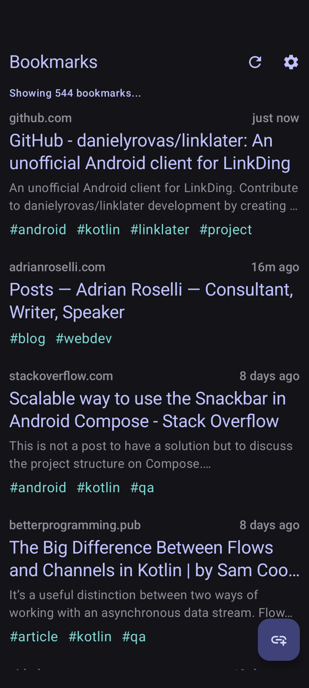
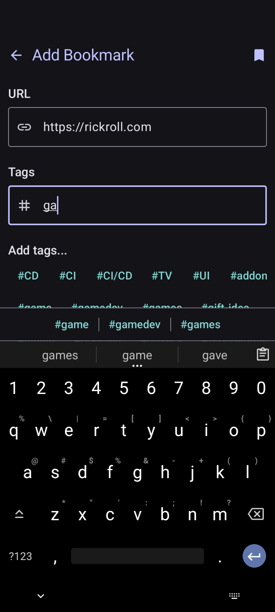
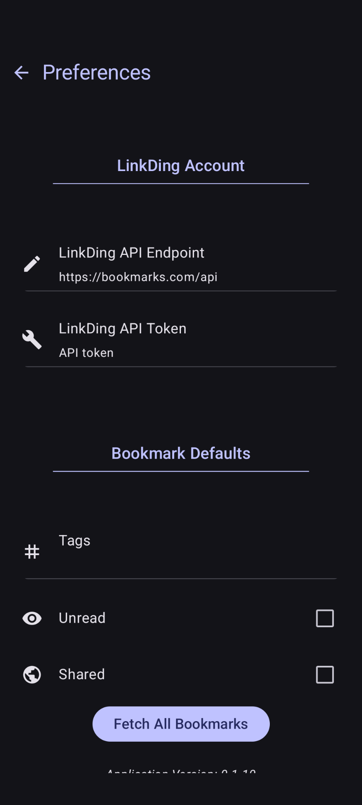

<h2 align="center"><strong>Linklater</strong></h2>
<h4 align="center">An unofficial Android client for <a href="https://github.com/sissbruecker/linkding">LinkDing</a>.</h4>

## Features
- Save bookmarks through the Android share menu.
- Easily add tags to bookmarks.
- View recent bookmarks.

## Examples

## Installation

1. Use an [F-Droid](https://f-droid.org/) [client](https://android.izzysoft.de/applists/category/named/apps_markets#group_1181) such as [Droid-ify](https://f-droid.org/en/packages/com.looker.droidify/) to install it from the [IzzySoft repository](https://apt.izzysoft.de/packages/org.yrovas.linklater/),
2. Use [Obtainium](https://github.com/ImranR98/Obtainium) to install and update from GitHub, or
3. Download the latest apk from the [releases page](https://github.com/danielyrovas/linklater/releases/latest).

## TODO:
- Provide management operations on bookmarks: edit/delete.
- Make tag predictions smarter.
- Tests.
- Use Fastlane to release on the Play store.

## Free Software

The Software is provided “as is”, without warranty of any kind. In no event shall the authors or copyright holders be liable for any claim, damages or other liability in connection with the Software.
